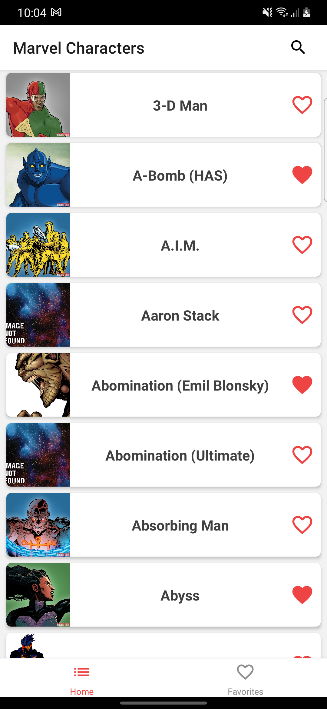
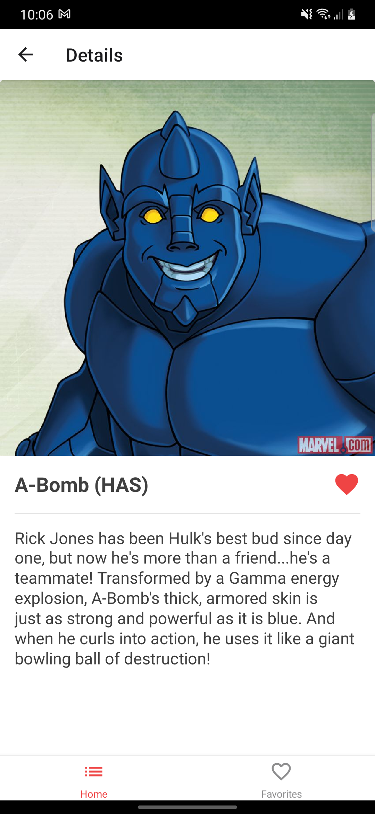
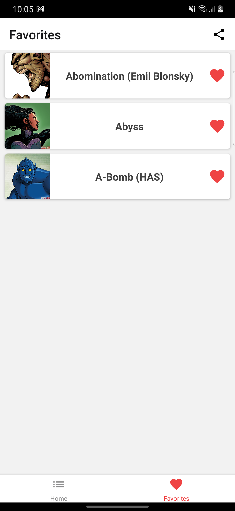
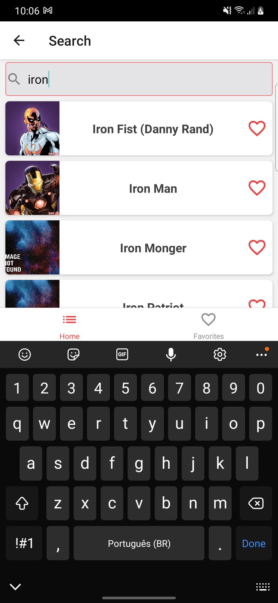
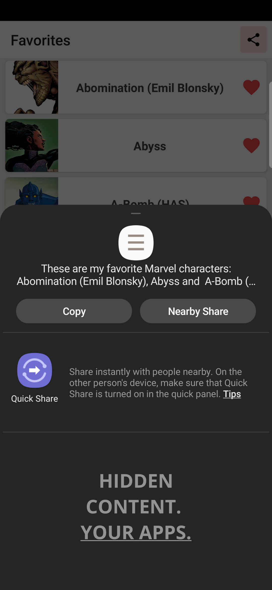

# Marvel Characters

## About the Project

Mobile app to show and search Marvel characters

## Screenshots

 
 


## Getting Started

This is an example of how you may give instructions on setting up your project locally.

### Built With

- [React Native](https://reactnative.dev/)

### Installation

1. Get a free API Key at [The Marvel Comics API](http://developer.marvel.com)
2. Clone the repo
3. Install dependencies
   ```sh
   yarn
   ```
4. Enter your API Keys in `/src/api/config.js`
   ```JS
   export const API_PUBLIC_KEY = 'ENTER YOUR PUBLIC API KEY';
   export const API_PRIVATE_KEY = 'ENTER YOUR PRIVATE API KEY';
   ```
   <!-- USAGE EXAMPLES -->

## Usage

This is a React Native project, so you can:

```sh
   yarn start
   yarn android
```

or

```sh
   yarn start
   yarn ios
```

## Contact

Cleiton Monteiro - [Linkedin](https://www.linkedin.com/in/cleitonmonteiroz/)
